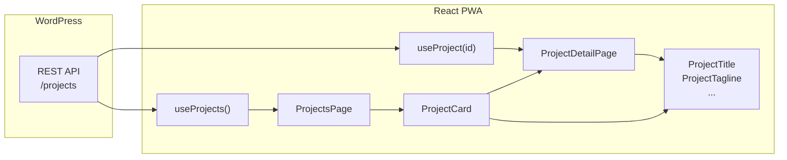

# Plán: React PWA vzorkovník pre JetEngine CCT

## Kontext dát z JSON súborov

- **[projects.json](projects.json)** – hlavný CCT `projects`: 12 meta polí (api_id: number; project_title, project_tagline, project_desc, project_content, project_type, project_category, project_client, project_link, project_gal_id: text; project_date: date; project_img_id: number).
- **[project_types.json](project_types.json)** a **[project_categories.json](project_categories.json)** – CCT bez vlastných meta polí; v projekte sú `project_type` / `project_category` zatiaľ textové polia. Typy pre tieto CCT môžeme pridať neskôr (napr. pre dropdowny), nie sú nutné na prvú verziu.

---

## 1. Inicializácia projektu a stack

- **Vite** + React + TypeScript (`npm create vite@latest . -- --template react-ts` v prázdnom priečinku alebo nový projekt a skopírovanie JSON súborov).
- **Závislosti**: `@tanstack/react-query`, `react-router-dom`, `tailwindcss` (PostCSS, autoprefixer), `vite-plugin-pwa`.
- **Konfigurácia**: `vite.config.ts` (aliasy, PWA plugin), `tailwind.config.js` s **CSS premennými** pre farby/fonty (jednoduchá zmena pre nový projekt), `tsconfig` s prísnejšími typmi.
- **Env**: `VITE_WP_API_URL` pre základnú URL WordPress API (bez koncovky `/wp-json/wp/v2` alebo s ňou – treba zosúladiť v hooku).

---

## 2. Dátové modely (TypeScript)

- **Súbor**: `src/types/project.ts`
- **Interface `ProjectCCT`** podľa [projects.json](projects.json) (presne názvy polí ako v CCT):
  - WP základ: `id: number`, `title?: { rendered: string }` (ak API vracia).
  - Meta: `api_id: number`, `project_title: string`, `project_tagline: string`, `project_desc: string`, `project_content: string`, `project_type: string`, `project_category: string`, `project_client: string`, `project_date: string`, `project_link: string`, `project_img_id: number`, `project_gal_id: string`.
  - Rozšírenie pre obrázok: `featured_image_url?: string` (doplnené na WP strane alebo ďalším fetchom).
- Voliteľne: `src/types/projectTypes.ts` pre `ProjectTypeCCT` / `ProjectCategoryCCT` (id, slug, …) ak plánuješ využiť endpointy typov/kategórií.

---

## 3. API vrstva a React Query

- **Konštanta**: `API_BASE_URL` z `import.meta.env.VITE_WP_API_URL` s fallbackom.
- **Fetch**: `fetchProjects(): Promise<ProjectCCT[]>` – GET na endpoint projektov (napr. `${API_BASE_URL}/wp-json/wp/v2/projects?_embed` alebo podľa JetEngine – endpoint môže byť iný, napr. custom route).
- **Hook**: `src/hooks/useProjects.ts` – `useQuery({ queryKey: ['projects'], queryFn: fetchProjects, staleTime: 5 * 60 * 1000 })`, vracia `{ data, isLoading, error }`.
- **Detail**: `src/hooks/useProject.ts` – `useQuery({ queryKey: ['project', id], queryFn: () => fetchProject(id) })` pre stránku detailu (voliteľné, ale odporúčané).
- **QueryClient**: v `main.tsx` (alebo layoutu) `QueryClientProvider` s rozumným `defaultOptions`.

---

## 4. Komponentová architektúra (Atomic Design)

- **Atómy** (pripravené na dáta z `ProjectCCT`):
  - `src/components/atoms/ProjectTitle.tsx` – prop `title`, voliteľne `className`.
  - `src/components/atoms/ProjectTagline.tsx` – prop `tagline`.
  - Ďalšie podľa potreby: napr. `ProjectMeta` (client + date), `ProjectCategoryBadge`.
- **Molekula**:
  - `src/components/molecules/ProjectCard.tsx` – props: `project: ProjectCCT`; zobrazí obrázok (`featured_image_url` alebo placeholder), tagline, title, klient, rok; `Link` na `/project/:id`.
- **Šablóny/stránky**:
  - **Zoznam**: `src/pages/ProjectsPage.tsx` – `useProjects()`, loading/error stavy, grid (Tailwind: `grid grid-cols-1 md:grid-cols-2 lg:grid-cols-3 gap-8`), mapovanie na `ProjectCard`.
  - **Detail**: `src/pages/ProjectDetailPage.tsx` – `useParams()` + `useProject(id)`, zobrazenie `project_content` (HTML), všetky polia projektu, odkaz `project_link` ak existuje; layout konzistentný s atómami/molekulami.

---

## 5. Routing a layout

- **React Router v6**: `createBrowserRouter` alebo `<Routes>` v `App.tsx`.
- Trasy: `/` → `ProjectsPage`, `/project/:id` → `ProjectDetailPage`.
- Jednoduchý layout (voliteľný): `src/components/layout/AppLayout.tsx` (header, main, footer) – aby sa dal ľahko meniť vzhľad bez zásahu do stránok.

---

## 6. Stylovanie (Tailwind + téma)

- **Tailwind**: globálne štýly v `src/index.css` (import Tailwind direktív; prípadne použitie CSS premenných z `tailwind.config.js`).
- **Téma**: V `tailwind.config.js` rozšíriť `theme.extend` o vlastné farby a fonty cez premenné (napr. `primary`, `secondary`, font-sans), aby stačila zmena configu pri klonovaní repozitára.
- Komponenty používajú tieto tokeny (napr. `text-primary-600`, `font-heading`) namiesto natvrdo zadaných farieb.

---

## 7. PWA

- **vite-plugin-pwa**: v `vite.config.ts` – generovanie manifestu a service workera (Workbox).
- **Manifest**: názov, short_name, theme_color, background_color, ikony (jedna placeholder ikona stačí na začiatok).
- **Offline**: základné caching pre assets a voliteľne pre API (napr. cache-first pre obrázky, network-first pre API).

---

## 8. Finálna štruktúra a “vzorkovník” workflow

- Štruktúra priečinkov: `src/{components/atoms|molecules|layout}, hooks, pages, types}`, `public`, env súbor `.env.example` s `VITE_WP_API_URL`.
- **README**: krátky návod: klonovať → nastaviť `VITE_WP_API_URL` → prípadne upraviť `tailwind.config.js` (farby, fonty) → `npm run dev` / `npm run build`. Zdôrazniť, že štruktúra CCT musí zodpovedať `ProjectCCT` (názvy polí) a že pre obrázky je potrebná `featured_image_url` alebo ekvivalent na strane WP.

---

## Poznámky k implementácii

- **WordPress REST API**: JetEngine môže vystavovať CCT na vlastnej ceste (nie štandardne `/wp/v2/projects`). V hooku treba použiť skutočný endpoint (prípadne dokumentovať v README).
- **Obrázky**: Ak API vracia len `project_img_id`, v pláne počítať s tým, že buď (a) WP endpoint rozšírime o `featured_image_url`, alebo (b) v Reacte doplníme druhý request na media endpoint – pre vzorkovník stačí placeholder + pole `featured_image_url?` v type.
- **project_gal_id**: V type ako `string`; ak je to zoznam ID oddelených čiarkou, spracovanie galérie môže byť ďalší krok (detail stránka).

Nižšie je prehľad závislostí a toku dát.

